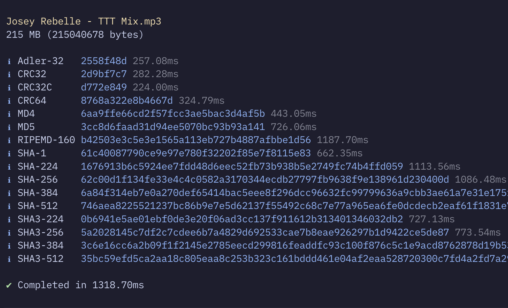

# Go Hashman!

> CLI to calculate multiple checksums at once.


[](https://github.com/idleberg/hashman/actions)

Here's a tool that I personally use a lot. It concurrently calculates checksums of a file in a variety of formats. Supports Adler-32, CRC32, CRC32C, CRC64, MD4, MD5, SHA-1, SHA-224, SHA-256, SHA-384, SHA-512, SHA3-224, SHA3-256, SHA3-384, and SHA3-512.



The name is inspired by [Hashman Deejay](https://futuretimes.bandcamp.com/album/sandopolis), whose music I love listening to while creating things.

## Installation 💿

### Homebrew

```sh
$ brew install idleberg/asahi/hashman
```

### Go

```sh
$ go install github.com/idleberg/hashman@latest
```

## Usage 🚀

```shell
hashman --all "Hashman Deejay - Sandopolis.zip"
```

See `hashman --help` for all available options.

## Related 👫

- [@idleberg/hashman](https://www.npmjs.com/package/@idleberg/hashman) - NodeJS implementation of this package

## Benchmark ⏱️

## Related 👫	

```
Benchmark 1: node-hashman -A Josey\ Rebelle\ -\ TTT\ Mix.mp3
  Time (mean ± σ):      1.354 s ±  0.019 s    [User: 8.719 s, System: 1.094 s]
  Range (min … max):    1.328 s …  1.391 s    10 runs
 
Benchmark 2: go-hashman -A Josey\ Rebelle\ -\ TTT\ Mix.mp3
  Time (mean ± σ):     745.9 ms ±  16.7 ms    [User: 3770.0 ms, System: 497.5 ms]
  Range (min … max):   718.7 ms … 767.1 ms    10 runs
 
Summary
  go-hashman -A Josey\ Rebelle\ -\ TTT\ Mix.mp3 ran
    1.82 ± 0.05 times faster than node-hashman -A Josey\ Rebelle\ -\ TTT\ Mix.mp3
```

## License ©️

This work is licensed under [The MIT License](LICENSE).
